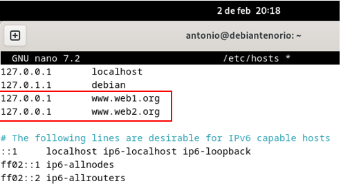
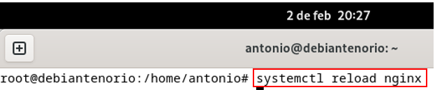

## 2.5	Casos prácticos.
**a)**	Comprobamos la versión instalada con el comando.

 •	**nginx -v**
 

 
**b)**	Verificamos el estado del servicio con el comando.

•	**systemctl status nginx** (Verificado anteriormente).

**c)**	Los principales ficheros de configuración de Nginx se encuentran en los siguientes directorios:

•	**/etc/nginx/nginx.conf** (configuración principal).

•	**/etc/nginx/sites-enabled/** (sitios habilitados).

•	**/etc/nginx/sites-available/** (sitios disponibles).

**d)**	Personalizamos la página web por defecto editándola y reemplazándola con nuestros datos.

````
<!DOCTYPE html>
<html>
<head>
    <title>Servidor Web_Nginx</title>
</head>
<body>
    <h1>Bienvenidos a mi servidor web</h1>
    <p>Antonio Gabino Tenorio Gañán_2º ASIR_IES Rodrigo Caro</p>
</body>
</html>
````


Abrimos el navegador Firefox dentro de la VM y escribimos en su barra de direcciones: http://localhost


**e)**	Configuramos virtual hosting, creando los directorios de los sitios web.

•	**mkdir -p /var/www/web1**

•	**mkdir -p /var/www/web2**


-	Cambiamos el propietario de los archivos y directorios, asignamos permisos al propietario, grupos y otros.
  
•	**chown -R www-data:www-data /var/www/web1** 

•	**chown -R www-data:www-data /var/www/web2**

•	**chmod -R 755 /var/www/**


-	Creamos los archivos **index.html** para cada sitio.
  
•	**nano /var/www/web1/index.html**

•	**nano /var/www/web2/index.html**

````
**Web1**
<!DOCTYPE html>
<html>
<head>
    <title>Bienvenidos a la página web1</title>
</head>
<body>
    <h1>Bienvenidos a la página web1 de Antonio Tenorio</h1>
</body>
</html>
````
````
**Web2**
<!DOCTYPE html>
<html>
<head>
    <title>Bienvenidos a la página web2</title>
</head>
<body>
    <h1>Bienvenidos a la página web2 de Antonio Tenorio</h1>
</body>
</html>
````


-	Configuramos dos archivos (web1 y web2) de sitio virtual de servidor en Nginx.
  
•	**nano /etc/nginx/sites-available/web1**

•	**nano /etc/nginx/sites-available/web2**


-	Habilitamos los sitios y creamos enlaces simbólicos.
  
•	**ln -s /etc/nginx/sites-available/web1 /etc/nginx/sites-enabled/**

•	**ln -s /etc/nginx/sites-available/web2 /etc/nginx/sites-enabled/**


-	Configuramos el archivo hosts para pruebas locales.
  
-	Como no tenemos un DNS configurado, añadimos las entradas en el archivo /etc/hosts.
  
•	**nano /etc/hosts**



-	Comprobamos la configuración de Nginx, verificando que todo esté correcto.
  
•	**nginx -t**


-	Recargamos Nginx y aplicamos los cambios con el comando.
  
•	**systemctl reload nginx**



-	Comprobamos que cada dominio muestre su página de bienvenida de Nginx.
  
•	**http://www.web1.org**

•	**http://www.web2.org**


f)	Autenticación, autorización y control de acceso

-	 Debemos configurar:
  
•	www.web1.org (sea accesible desde red interna y externa).

•	www.web2.org (sea accesible desde red interna).

-	Configuración de acceso.
  
1.	Editamos el archivo de configuración de Nginx para cada sitio web1 y web2.
   
o	**nano /etc/nginx/sites-available/web1**

o	**nano /etc/nginx/sites-available/web1**


2.	Probamos la configuración realizada y reiniciamos Nginx.
   
o	**nginx -t**

o	**systemctl reload nginx** 

o	**systemctl restart nginx**


-	Desde un cliente en la red interna, accedemos a ambos dominios.
  
o	**http://www.web1.org**

o	**http://www.web2.org**

-	Desde un cliente Debian 12 también en la red externa, accedemos a web1.
  
o	**http:// www.web1.org**


