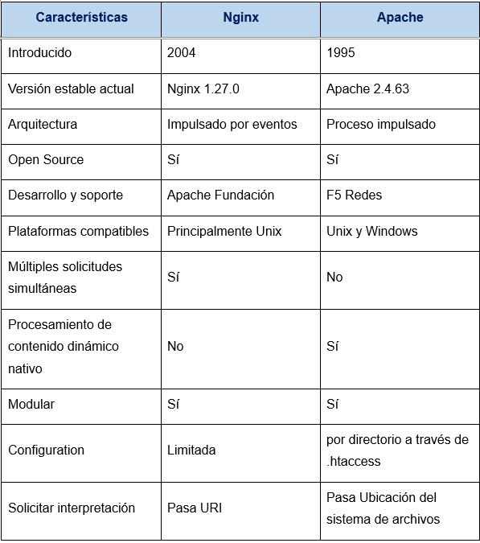

# 2.	Comparativa con Apache.
## 1.	Características.
**Apache** y **Nginx** son servidores web de alto rendimiento y código abierto compatibles con Windows y Linux.

•	**Apache** (1995) es una solución integral con soporte nativo para múltiples módulos y tecnologías. Es ampliamente documentado y respaldado por la Apache Software Foundation.

•	**Nginx** (2004) fue diseñado para manejar miles de conexiones concurrentes con mejor eficiencia que Apache. Funciona como servidor web y proxy inverso. En 2019, fue adquirido por F5 Networks.

**Diferencias clave:**
- **Apache** es *flexible* y *modular*, pero menos eficiente en alta concurrencia.
- **Nginx** es más *rápido* en el manejo de grandes volúmenes de tráfico y está *optimizado* para servidores modernos.
  
La elección depende de las necesidades: Apache para compatibilidad y módulos listos para usar, Nginx para alto rendimiento y escalabilidad. 
## 2.	Cuotas de mercado.

Estadísticas de uso de servidores web basadas en datos de W3Techs. Durante los últimos 3 años **Nginx** y **Apache** han estado en la cima del mercado de servidores web.
## 3.	Diferencias clave.

## 4.	Arquitectura central de Apache vs. Nginx.
**Nginx** usa una arquitectura basada en eventos, consumiendo menos memoria y manejando mejor el tráfico alto y los picos de carga.

**Apache** usa una arquitectura basada en procesos, asignando un hilo por conexión, lo que aumenta el consumo de memoria, pero escala bien en servidores con múltiples núcleos de CPU y gran RAM.
- Nginx = Más eficiente en alto tráfico.
- Apache = Mejor en servidores con muchos recursos.
## 5.	Consumo de recursos en Apache vs. Nginx.
**Nginx** es más ligero y eficiente, ya que usa un solo proceso para manejar múltiples conexiones simultáneamente.

**Apache** consume más memoria, creando un hilo por conexión y nuevos procesos para cada solicitud, lo que puede ser problemático en servidores con poca RAM.
- Nginx = Menos consumo de RAM, ideal para alto tráfico.
- Apache = Mayor uso de memoria, pero flexible con módulos.
## 6.	Manejo de PHP en Apache vs. Nginx.
**Nginx** usa PHP-FPM (FastCGI Process Manager), lo que le permite manejar múltiples solicitudes simultáneamente sin esperar respuestas, mejorando el rendimiento.

**Apache** usa mod_php, ejecutando PHP dentro de sus procesos, lo que genera mayor carga en el sistema al crear nuevos procesos o hilos para cada solicitud.
- Nginx = Más eficiente con PHP-FPM.
- Apache = Más consumo de recursos con mod_php.
## 7.	Nginx vs. Apache para WordPress.
**Nginx** mejora los tiempos de carga y maneja mejor el tráfico alto gracias a su arquitectura basada en eventos, ideal para contenido estático.

**Apache** facilita el procesamiento de contenido dinámico con mod_php, pero es menos eficiente en el manejo de múltiples conexiones simultáneas.
- Nginx = Mejor rendimiento y eficiencia en WordPress con alto tráfico.
- Apache = Más sencillo para contenido dinámico, pero con mayor consumo de recursos.
## 8.	Cuándo elegir Apache.
**Compatibilidad con sistemas heredados:** Ideal si ya usas Apache y dependes de .htaccess para configuraciones flexibles.
- Procesamiento de contenido dinámico: Integración directa con PHP, Python y Ruby mediante módulos internos.
- Facilidad de uso: Amplia documentación y soporte comunitario, ideal para principiantes.
## 9.	Cuándo elegir Nginx.
**Alto rendimiento y escalabilidad:** Maneja muchas conexiones con bajo consumo de memoria, ideal para sitios de alto tráfico.
- Equilibrio de carga y proxy inverso: Distribuye tráfico entre servidores backend, mejorando disponibilidad y rendimiento.
- Entrega eficiente de contenido estático: Óptimo para servir imágenes, CSS y scripts con mínima sobrecarga.
- Configuración sencilla: Aunque no soporta .htaccess, su sintaxis es clara y fácil de gestionar.

