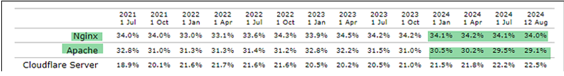

# 2.	Comparativa con Apache.
## 1.	Características.
**Apache** y **Nginx** son servidores web de alto rendimiento y código abierto compatibles con Windows y Linux.

•	**Apache** (1995) es una solución integral con soporte nativo para múltiples módulos y tecnologías. Es ampliamente documentado y respaldado por la Apache Software Foundation.

•	**Nginx** (2004) fue diseñado para manejar miles de conexiones concurrentes con mejor eficiencia que Apache. Funciona como servidor web y proxy inverso. En 2019, fue adquirido por F5 Networks.

**Diferencias clave:**
- **Apache** es *flexible* y *modular*, pero menos eficiente en alta concurrencia.
- **Nginx** es más *rápido* en el manejo de grandes volúmenes de tráfico y está *optimizado* para servidores modernos.
  
La elección depende de las necesidades: Apache para compatibilidad y módulos listos para usar, Nginx para alto rendimiento y escalabilidad. 
## 2.	Cuotas de mercado.

Estadísticas de uso de servidores web basadas en datos de W3Techs. Durante los últimos 3 años **Nginx** y **Apache** han estado en la cima del mercado de servidores web.
## 3.	Diferencias clave.
