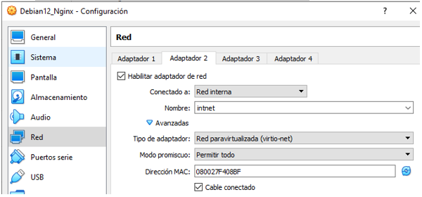
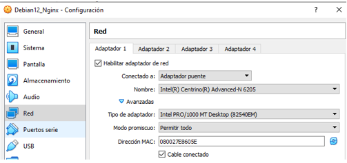
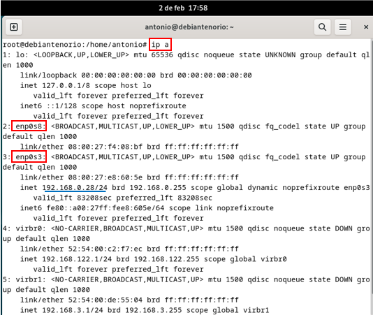
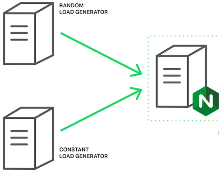

# 3.	Esquema de red.
Comenzamos configurando dos tarjetas de red en una VM Debian 12.

•	**Red interna:** La VM donde instalamos el servidor web **Nginx** tendrá comunicación interna y acceso a recursos protegidos.

•	**Red externa:** La VM tendrá comunicación con usuarios externos e Internet.

## Resumen del esquema de red.

