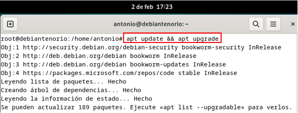
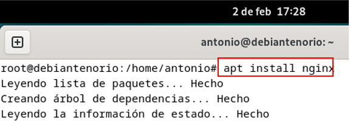
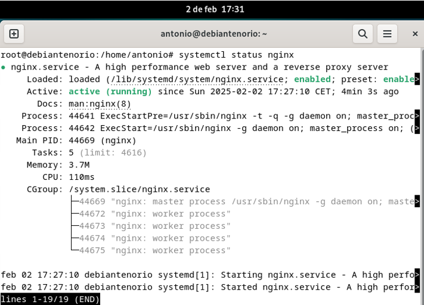
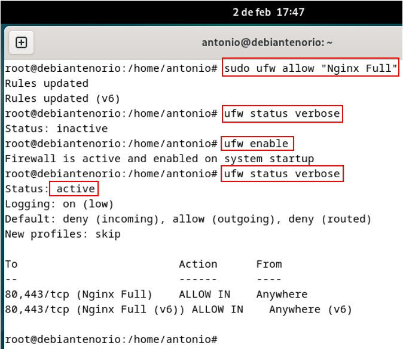

## 2.4	Instalación.
Pasos para instalar Nginx en un sistema Linux (Debian 12). 
1.	Actualizamos los repositorios con el comando.
   
    •	**apt update && apt upgrade**
  	
  	

3.	Instalamos Nginx con el comando.
   
    •	**apt install nginx**
  	
  	

5.	Verificamos el estado del servicio con el comando.
   
    •	**systemctl status nginx**
  	
  	

7.	Permitimos el tráfico HTTP/HTTPS en el firewall con el comando.
      
    •	**apt install ufw** (permitir el tráfico en los puertos 80 (HTTP) y 443 (HTTPS).
  	
    •	**ufw allow “Nginx Full”**
  	
    •	**ufw status verbose** (el servicio estaba desactivado, por lo que lo activamos).
  	
    •	**ufw enable** (activación del servicio ufw).
  	

